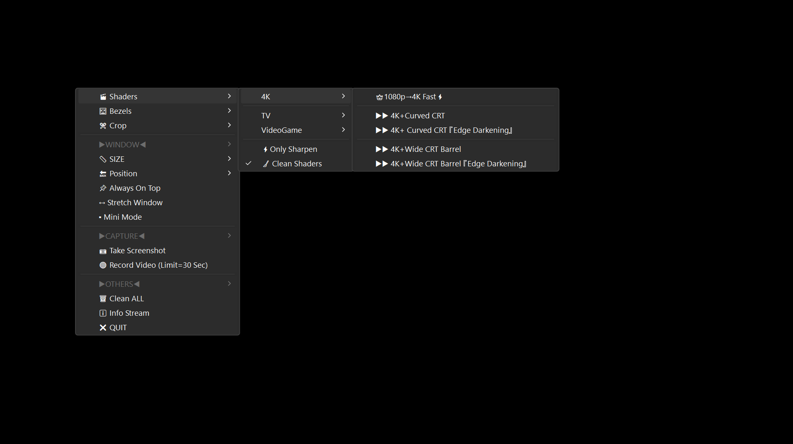
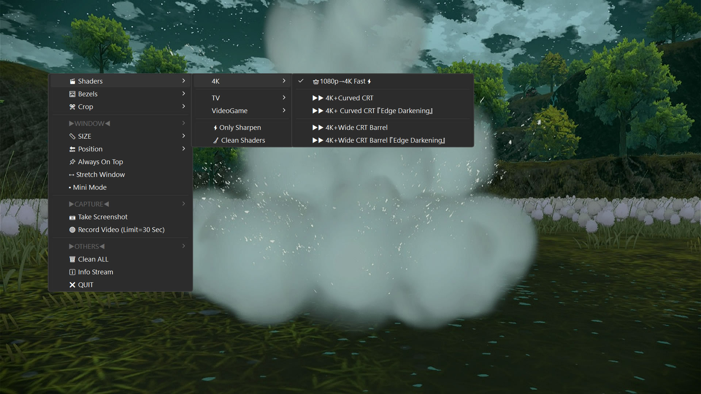
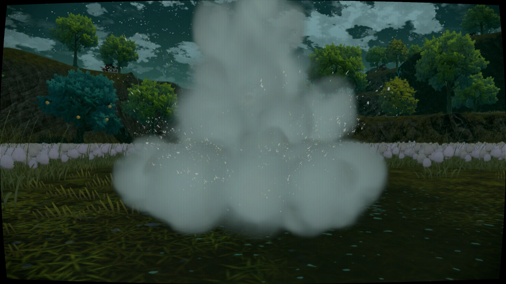
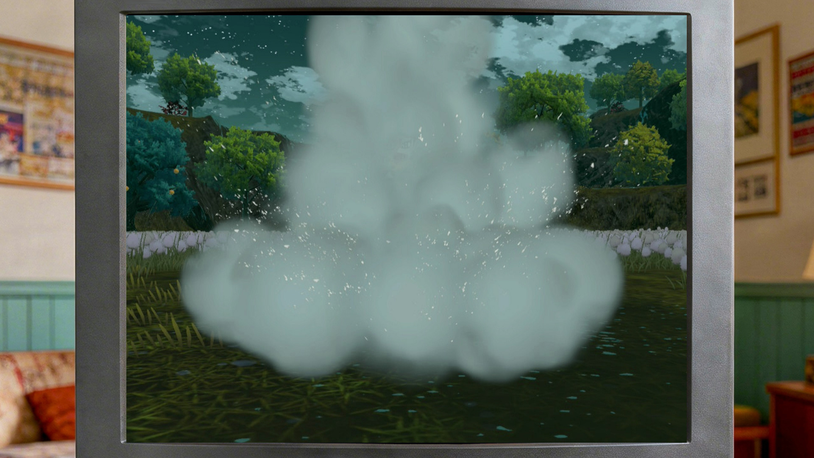
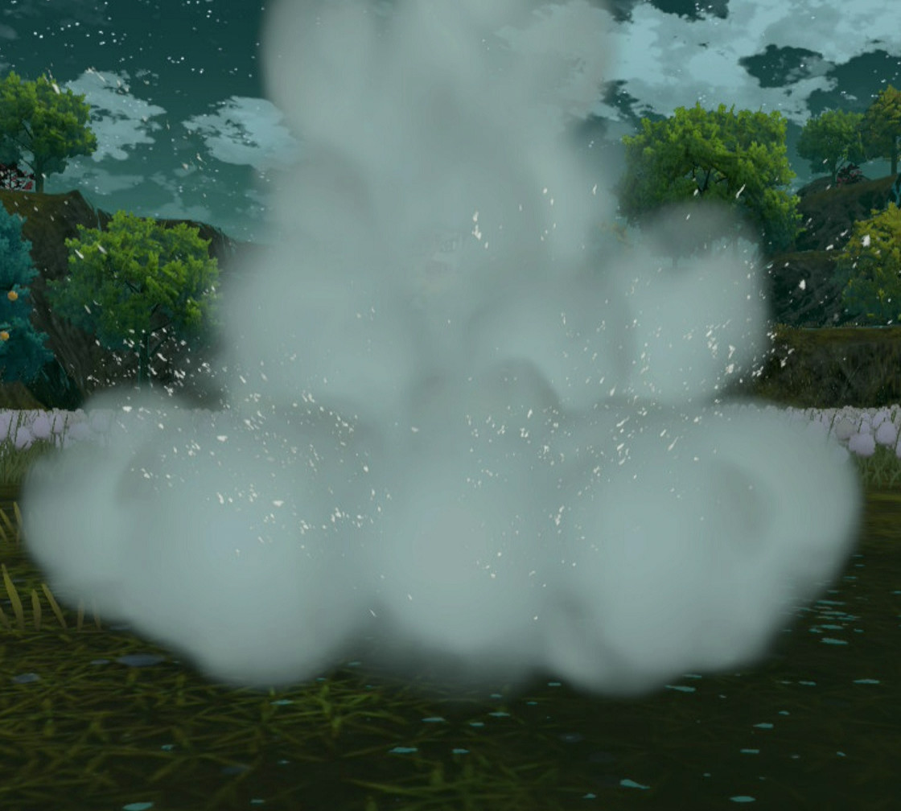
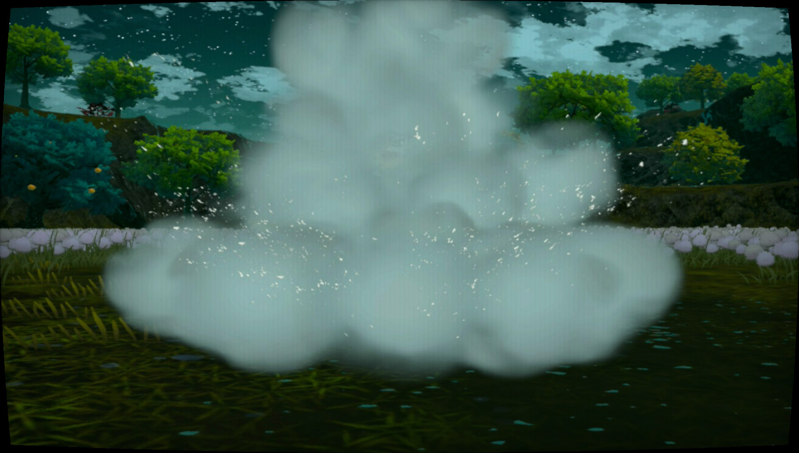

# MPV‑SW‑Capture
Configurable and ready‑to‑use MPV for Windows, adapted for USB 3.0 capture cards to play your **own real** Video Game Console (such as SW/2, or any other) with minimal lag/latency and with many extra features.



---

## 📋 Features
- **Play any console** (Nintendo Switch / Switch 2 or any other) through your USB capture card using MPV.
- **With minimal lag/latency** – play your real console with minimal lag/latency. Nearly the same as connect it directly to TV.
- **Portable** – copy/move and use the whole folder in any location; it will work there without reinstallation.
- **Custom menu** (accessible via right‑click or a hotkey) with:
  - **Shaders** – load shaders to improve image quality up to 4K or switch to retro looks (CRT TV, VHS, CRT arcade, etc.).
  - **Bezels** – overlay special border images (e.g., SNES NSO bezel) for an authentic feel.
  - **Crop** – crop the window to the exact size of a NSO system (GBA, NES, SNES, etc.).
  - **Window options** – resize, reposition, set Always on Top, and more.
  - **Screenshots** – automatically save screenshots to your MPV folder.
  - **Video recording** – record 30 seconds of good‑quality, small‑size video.
- **Customize** the menu, replace and add your own bezels and shaders.

## ⚙️ How it works (minimal lag/latency audio + video)
MPV alone can introduce noticeable latency when handling both audio and video from a capture card.  
This setup **splits the workload**:
- MPV handles the video stream only.
- `ffplay` (from the ffmpeg bundle) handles the audio stream only.

Both programs run silently, stay in sync, and together deliver minimal lag/latency gameplay with audio and video.

## 📦 Requirements

- A PC with USB 3.0 (USB 2.0 works but performance will be noticeably worse).
- A capture card that supports 1080p60 and provides loop‑through (input + output) – e.g., “4K Ultra HD USB 3.0 HD Video Capture (MS 2131)” or any similar device.
- Your own official video game console.
- mpv player: **not** distributed in this repository. Download an appropriate build (for example, the official Windows builds by zhongfly: https://github.com/zhongfly/mpv-winbuild/releases, or your distro’s packages).
- ffmpeg/ffplay: **not** distributed in this repository. Download from the official project or a trusted build provider (for example, the Essentials build from https://www.gyan.dev/ffmpeg/builds/).

Note: mpv and ffmpeg/ffplay are third‑party dependencies with their own licenses (LGPL/GPL, etc.). They are required to use this project but are not bundled in this repository or its release assets.

## 🛠️ Installation (step‑by‑step)

1. **Download files**
   - Download MPV (latest official zhongfly build):
     - Go to <https://github.com/zhongfly/mpv-winbuild/releases>.
     - Choose the latest build matching your Windows version (64‑bit, 64‑bit‑legacy for older PCs, or ARM64) and download the `.7z` archive.
   - Download ffmpeg/ffplay:
     - Visit <https://www.gyan.dev/ffmpeg/builds/>.
     - Download the latest `ffmpeg-git-essentials.7z`.
   - Get MPV‑SW‑Capture:
     - Download the [latest release of this repository (ZIP)](https://github.com/TyRaS-SW/MPV-SW-Capture/releases).

2. **Prepare the folder**
   - Create a folder (e.g. `MPV-SW-Capture`) anywhere you like.
   - Open the latest MPV version (zhongfly build) you downloaded and extract **only** `mpv.exe` into that folder.
   - Open `ffmpeg-git-essentials.7z`, go to the `bin` folder, and copy `ffplay.exe` and `ffmpeg.exe` into the same folder where `mpv.exe` lives.
   - Open the latest MPV‑SW‑Capture release and extract **all the files** into this same folder.

   You should end up with something like:

   ```text
   MPV-SW-Capture/
   ├── bezels/
   ├── scripts/
   ├── shaders/
   ├── _Setup_MPV-SW-Capture.bat
   ├── ffmpeg.exe
   ├── ffplay.exe
   ├── input.conf
   ├── menu.conf
   ├── MPV-SW-Capture.bat
   ├── MPV-SW-Capture.vbs
   ├── mpv.conf
   └── mpv.exe
   ```

3. **First setup**

   **Connection**
   - Connect your capture card to your PC using USB 3.0 (or USB 2.0).
   - Connect HDMI from your console to the **input** of the capture card.

   **Setup file**
   - Inside the folder, run `_Setup_MPV-SW-Capture.bat`. It will list all audio and video devices currently attached.  
     (If nothing is connected, the list will be empty. Close the window, connect your devices, and try again.)
   - Choose the video device (press the corresponding number) and then the audio device.
   - The batch file updates the necessary config files with your selections.
   - Follow the prompts to set your preferences (date format for screenshots and video, autostart with shaders, and whether to create a desktop shortcut).

4. **Launch the stream in MPV**
   - Run `MPV-SW-Capture.vbs` (you can create a desktop shortcut for convenience).
   - If everything is set correctly, you will see your console with audio and video.
   - To access the menu, right‑click inside the window or press `ESC`. Double‑click toggles full screen.

## 🖼️ Screenshots / Examples
Some visual examples of MPV‑SW‑Capture in action:

| <center>Custom Menu</center> | <center>Shader example</center> |
|----------|----------|
|  |  |
| <center><small>*Right‑click / ESC menu with shaders, bezels, crop, window and capture options.*</small></center> | <center><small>*Example of a CRT‑style shader applied through MPV‑SW‑Capture.*</small></center> |

| <center>Bezel example</center> | <center>Crop example</center> |
|----------|----------|
|  |  |
| <center><small>*Example bezel applied around the captured image for a more authentic look.*</small></center> | <center><small>*Window cropped to match a GB resolution in NSO, using the crop presets. Perfect if you don't want the normal borders.*</small></center> |

| <center>Stretch window example</center> | <center>Combination example</center> |
|----------|----------|
|  |  |
| <center><small>*Stretch Window option enabled to fill more of the screen while keeping the capture visible.*</small></center> | <center><small>*Example of a Combination of Shader+Crop (to 4:3)+Stretch. Crop cannot mix with Bezel.*</small></center> |

Bezel images included in this project are generic CRT/handheld-style frames (created/edited for this project) and are not official assets from any console or game. They are decorative overlays only.

## ❓ FAQ (Frequently Asked Questions)

You can find the FAQ here: [FAQ](https://github.com/TyRaS-SW/MPV-SW-Capture/wiki/FAQ)

## 💖 Sponsors

If MPV-SW-Capture is useful to you, consider supporting development through [GitHub Sponsors](https://github.com/sponsors/TyRaS-SW).  
Sponsors help keep the project maintained and make new features possible.

You can also support me in Ko-fi: [](https://ko-fi.com/tyras_sw)

## 📄 License

This project (Lua scripts, batch files, bezels, documentation, and original shaders authored by TyRaS-SW) is licensed under the MIT License – see the `LICENSE` file.

This repository also bundles third‑party shaders under their own licenses (BSD‑style permissive licenses, the GNU Lesser General Public License (LGPL), vendor‑specific licenses such as the AMD FidelityFX SDK license, and other upstream terms).
See `NOTICE.md` and the headers of individual shader files for details.

The MIT License in this repository applies only to original code authored by TyRaS-SW. It does **not** relicense or override the terms of third‑party shaders or external binaries (mpv, ffmpeg, etc.), which remain under their respective upstream licenses.

## 🏷️ Trademark disclaimer
Nintendo Switch and Nintendo Switch 2 are trademarks of Nintendo Co., Ltd.  
This project is not affiliated with, endorsed by, or sponsored by Nintendo.
