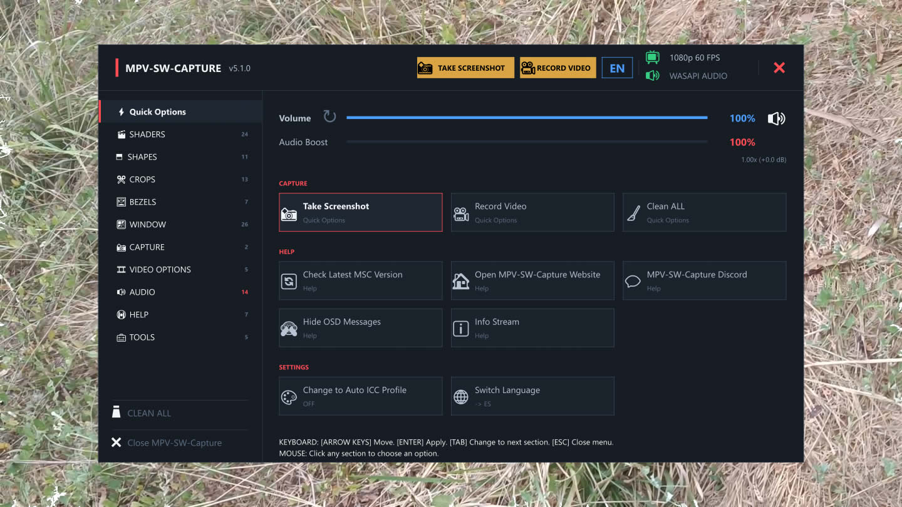
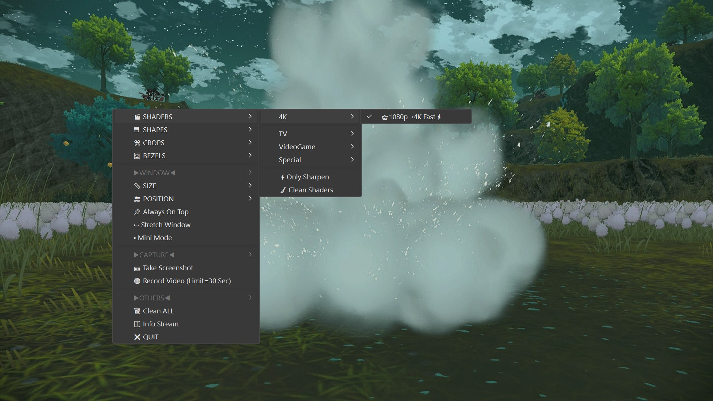
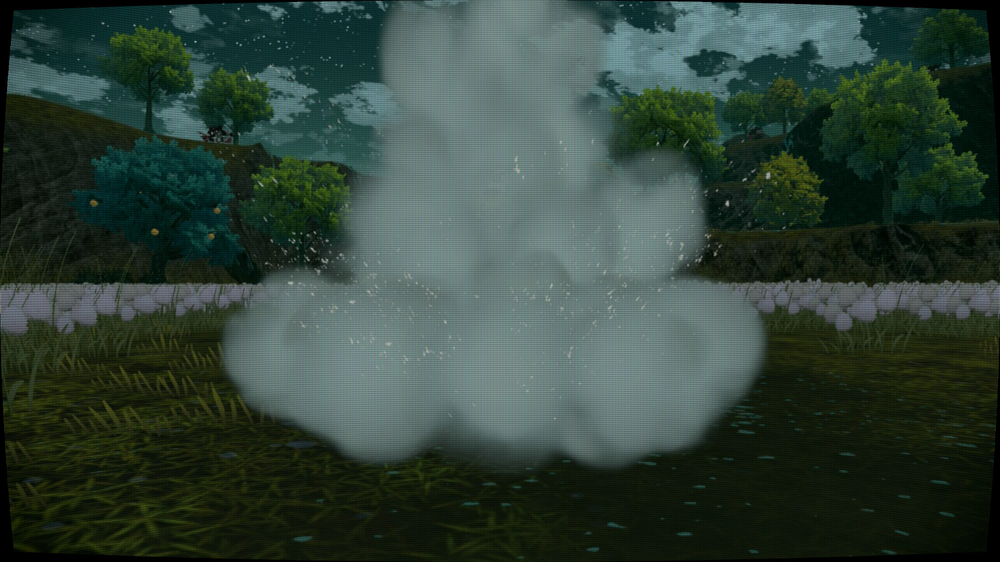
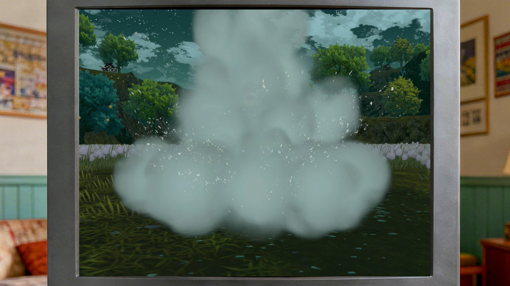
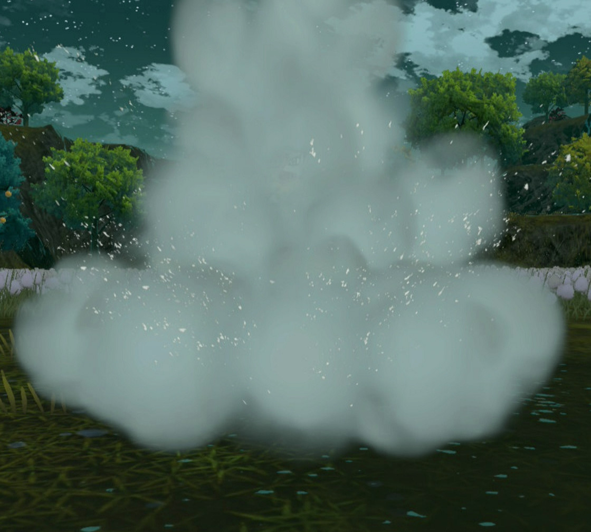
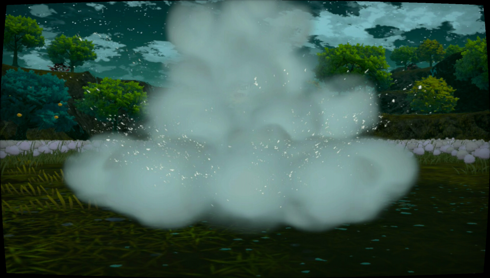

# MPV‑SW‑Capture

A complete program with ready‑to‑use configurations for MPV on Windows, optimized for USB capture cards. Play with any HDMI video game console with **minimal as possible latency** and **endless options**.

---

## 📋 Features

- **Play any console HDMI‑compatible console** through your USB capture card using MPV.
- **Minimal lag/latency** – play your real console with lag almost as low as connecting it directly to a TV.
- **Portable** – copy the whole folder anywhere and it will work without reinstallation.
- **Two audio backends** – choose the one that fits your setup best:
  - **WASAPI Audio Plugin** (default) – native in‑process audio, low CPU and RAM usage, and directly capturable by OBS, Discord, and other tools without third‑party plugins.
  - **FFplay Low Latency** – the classic split‑process backend. Used as a fallback for systems where the WASAPI plugin is not supported.
- **Hover Volume Sidebar** – move the cursor to the middle‑left edge of the window and a floating audio rail appears, letting you adjust Volume and Audio Boost without opening the menu.
- **Custom menu** (right‑click or `ESC`) with:
  - **Shaders** – improve image quality up to 4K or apply retro looks (CRT, VHS, Arcade, etc.).
  - **Shapes** – change the screen geometry (curvature, keystone, etc.).
  - **Crop** – crop the window to the exact size of an NSO system (GBA, NES, SNES, etc.).
  - **Bezels** – overlay decorative borders (e.g., SNES NSO bezel) for an authentic feel. Includes "Fit Full 16:9 to Bezel" to fit the entire 16:9 image inside any bezel frame without cutting.
  - **Window options** – resize, reposition, always on top, and more.
  - **Screenshots** – automatically save screenshots to your MPV folder.
  - **Video recording** – record 30/60/90/120 second clips with good quality and small file size.
  - **Audio Boost** – amplifies capture audio from 100% up to 400% for low‑volume content.
- **Persistent settings** – the following options are saved and restored between sessions:
  - Audio Boost value.
  - Audio Output Mode (WASAPI / FFplay).
  - Hover Volume Sidebar (enabled / disabled).
  - Auto ICC Profile (enabled / disabled).
- **Multi‑language menu** – English, Spanish, and Japanese included.
- **Fully customizable** – add your own bezels, shaders, and menu entries.

---

## ⚙️ How it works (minimal lag/latency)

MPV alone can introduce noticeable latency when handling both audio and video from a capture card. To solve this, MPV‑SW‑Capture offers **two audio backends**, and you can choose the one that works best on your system:

### WASAPI Audio Plugin (default)

A native plugin loaded directly into MPV that captures audio from the selected device and lets the application output it like any other Windows audio source.

- **MPV** handles both the video and audio streams through the plugin.
- Audio is **capturable natively by OBS, Discord, and similar tools** without third‑party plugins.
- Lower CPU and RAM usage compared to the FFplay backend.
- Available in Windows 10 and 11 on most modern capture cards.

### FFplay Low Latency (fallback)

The classic split‑process approach:

- **MPV** handles the video stream only.
- **`ffplay`** (from the ffmpeg bundle) handles the audio stream only.

Both programs run silently, stay in sync, and together deliver minimal‑lag gameplay with audio and video. This mode is intended for systems where the WASAPI plugin is not supported, or for users who prefer the older pipeline.

You can switch between the two backends at any time from **AUDIO → AUDIO OUTPUT MODE** in the menu, or from the Setup tool.

---

## 📦 Requirements

- A PC with **USB 3.0** (USB 2.0 works but performance will be noticeably worse).
- A capture card that supports **1080p60** and provides loop‑through (input + output) – e.g., “4K Ultra HD USB 3.0 HD Video Capture (MS 2131)” or any similar device.
- Your own official video game console.
- **mpv player** and **ffmpeg/ffplay** (see note below).

> **✨ Note on dependencies:**  
> While this project does not bundle mpv or ffmpeg/ffplay due to licensing and size constraints, the included **Installer** tools can download and place the correct versions automatically.  
> For most users, this is the simplest way to get started.  
> If you prefer, you can also obtain them manually from their official sources:
> - [mpv (zhongfly builds)](https://github.com/zhongfly/mpv-winbuild/releases)
> - [ffmpeg (gyan.dev Essentials)](https://www.gyan.dev/ffmpeg/builds/)

---

## 🛠️ Installation

For a complete, step‑by‑step installation guide, please visit:

👉 **[Installation Guide](https://github.com/TyRaS-SW/MPV-SW-Capture/wiki/Guide%E2%80%90Installation)**

> The guide covers everything from downloading the release, running the first‑time installer (`1_INSTALLER_MSC_First-Usage.cmd`), configuring the app through the Setup tool, to launching MPV‑SW‑Capture for the first time.

If you prefer the older manual installation method, you can find it here:  
**[MANUAL Install](https://github.com/TyRaS-SW/MPV-SW-Capture/wiki/Guide%E2%80%90MANUAL-Installation)**

---

## 🖼️ Screenshots / Examples

| Custom Menu | Shader + Shape example |
|-------------|------------------------|
|  |  |
| *Right‑click / ESC menu with shaders, bezels, crop, window and capture options.* | *Example of a CRT‑style shader + CRT Curved Shape applied through MPV‑SW‑Capture.* |

| Bezel example | Crop example |
|---------------|--------------|
|  |  |
| *Example bezel applied around the captured image for a more authentic look.* | *Window cropped to match a GB resolution in NSO, using the crop presets. Perfect if you don't want the normal borders.* |

| Stretch window example | Combination example |
|------------------------|---------------------|
|  |  |
| *Stretch Window option enabled to fill more of the screen while keeping the capture visible.* | *Example of a combination of Shader + Crop (to 4:3) + Stretch. Crop cannot be mixed with Bezel.* |

> Bezel images included in this project are generic CRT/handheld‑style frames (created/edited for this project) and are not official assets from any console or game. They are decorative overlays only.

---

## ❓ FAQ

You can find the Frequently Asked Questions here:  
**[FAQ](FAQ.md)**

---

## 📄 LEEME en Español (Spanish README)

Puedes encontrar este README en Español aquí:  
**[LEEME](https://github.com/TyRaS-SW/MPV-SW-Capture/wiki/LEEME)**

---

## 💖 Sponsors

If MPV‑SW‑Capture is useful to you, consider supporting development through [GitHub Sponsors](https://github.com/sponsors/TyRaS-SW).  
Sponsors help keep the project maintained and make new features possible.

You can also support me on Ko‑fi:  

---

## 📄 License

This project (Lua scripts, batch files, bezels, documentation, and original shaders authored by TyRaS‑SW) is licensed under the **MIT License** – see the `LICENSE` file.

This repository also bundles third‑party shaders under their own licenses (BSD‑style permissive licenses, the GNU Lesser General Public License (LGPL), vendor‑specific licenses such as the AMD FidelityFX SDK license, and other upstream terms).  
See `NOTICE.md` and the headers of individual shader files for details.

The MIT License in this repository applies **only** to original code authored by TyRaS‑SW. It does **not** relicense or override the terms of third‑party shaders or external binaries (mpv, ffmpeg, etc.), which remain under their respective upstream licenses.

---

## 🏷️ Trademark disclaimer

Nintendo Switch and Nintendo Switch 2 are trademarks of Nintendo Co., Ltd.  
This project is not affiliated with, endorsed by, or sponsored by Nintendo.